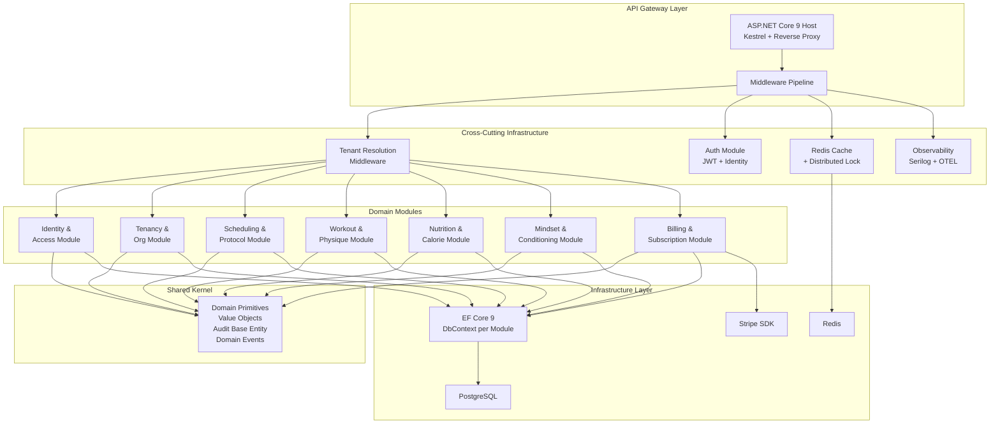
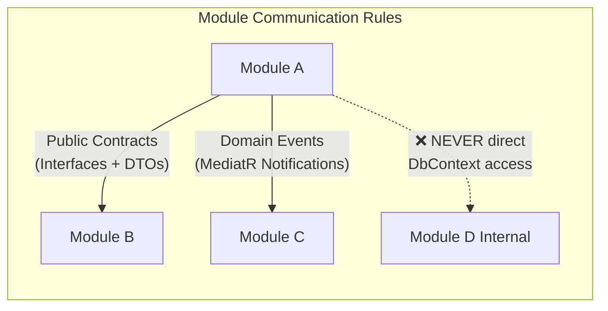
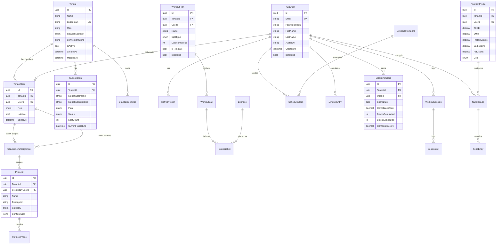
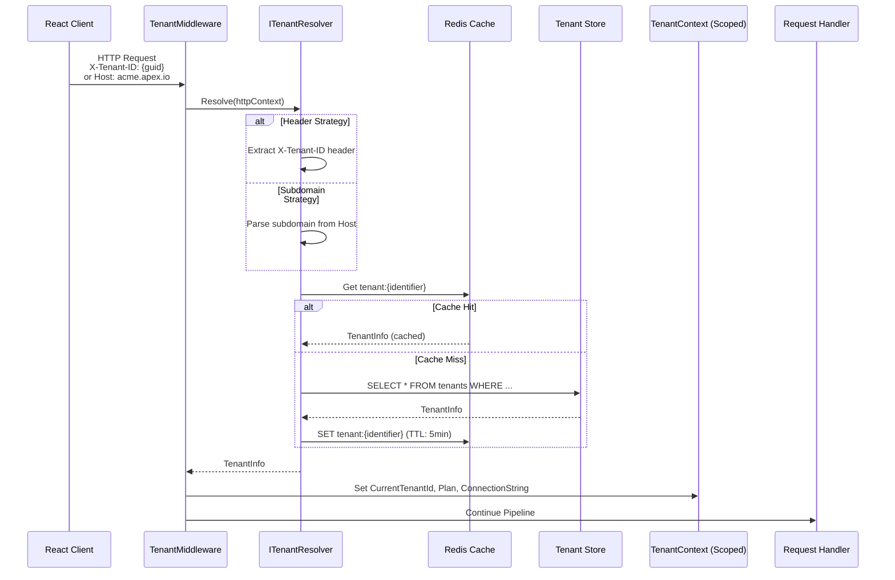
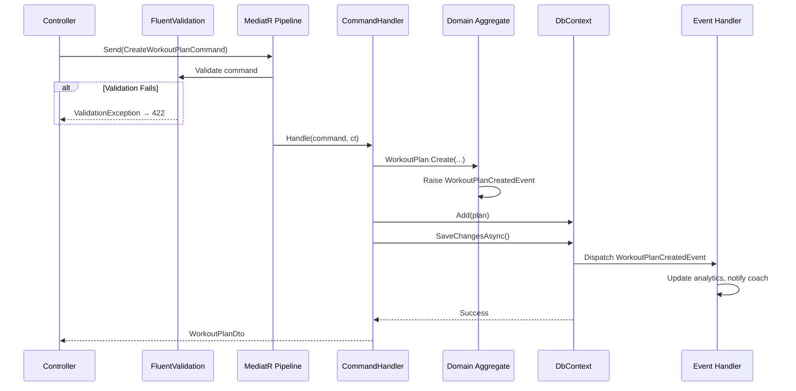
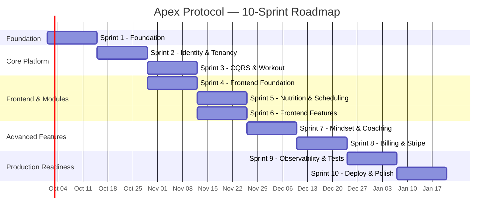

# Apex Protocol — Enterprise Architecture Blueprint

> **Version**: 1.0 · **Date**: 2026-09-24 · **Classification**: Production Architecture Specification
> **Stack**: ASP.NET Core 9 · EF Core 9 · PostgreSQL · Redis · React 18 · TypeScript · Vite

---

## Table of Contents

1. [High-Level Architecture Diagram](#1-high-level-architecture-diagram)
2. [Database Schema & EF Core Entities](#2-database-schema--ef-core-entities)
3. [Tenancy Resolution Pipeline](#3-tenancy-resolution-pipeline)
4. [CQRS Implementation Example](#4-cqrs-implementation-example)
5. [Frontend State Management & API Client](#5-frontend-state-management--api-client)
6. [10-Sprint Production Roadmap](#6-10-sprint-production-roadmap)
7. [Resume Bullet Points](#7-resume-bullet-points)

---

## 1. High-Level Architecture Diagram

### Modular Monolith — Module Decomposition



### Module Interaction Policy



> [!IMPORTANT]
> Each module owns its own **EF Core `DbContext`**, schema namespace, and migration history. Cross-module communication is **exclusively** via public contracts (interfaces in a shared `Contracts` assembly) or domain events (MediatR `INotification`). No module may reference another module's internal entities or repositories.

### Solution Structure

```
ApexProtocol/
├── src/
│   ├── ApexProtocol.Api/                        # Host + Middleware + Controllers
│   ├── ApexProtocol.SharedKernel/               # Base entities, Value Objects, Domain Event interfaces
│   │
│   ├── Modules/
│   │   ├── Identity/
│   │   │   ├── ApexProtocol.Identity.Contracts/  # Public interfaces + DTOs
│   │   │   ├── ApexProtocol.Identity.Domain/     # Aggregates, Entities, Value Objects
│   │   │   ├── ApexProtocol.Identity.Application/ # Commands, Queries, Validators, Handlers
│   │   │   └── ApexProtocol.Identity.Infrastructure/ # EF DbContext, Repos, Identity config
│   │   │
│   │   ├── Tenancy/
│   │   │   ├── ApexProtocol.Tenancy.Contracts/
│   │   │   ├── ApexProtocol.Tenancy.Domain/
│   │   │   ├── ApexProtocol.Tenancy.Application/
│   │   │   └── ApexProtocol.Tenancy.Infrastructure/
│   │   │
│   │   ├── Scheduling/
│   │   │   ├── ApexProtocol.Scheduling.Contracts/
│   │   │   ├── ApexProtocol.Scheduling.Domain/
│   │   │   ├── ApexProtocol.Scheduling.Application/
│   │   │   └── ApexProtocol.Scheduling.Infrastructure/
│   │   │
│   │   ├── Workout/
│   │   │   ├── ApexProtocol.Workout.Contracts/
│   │   │   ├── ApexProtocol.Workout.Domain/
│   │   │   ├── ApexProtocol.Workout.Application/
│   │   │   └── ApexProtocol.Workout.Infrastructure/
│   │   │
│   │   ├── Nutrition/
│   │   │   ├── ApexProtocol.Nutrition.Contracts/
│   │   │   ├── ApexProtocol.Nutrition.Domain/
│   │   │   ├── ApexProtocol.Nutrition.Application/
│   │   │   └── ApexProtocol.Nutrition.Infrastructure/
│   │   │
│   │   ├── Mindset/
│   │   │   ├── ApexProtocol.Mindset.Contracts/
│   │   │   ├── ApexProtocol.Mindset.Domain/
│   │   │   ├── ApexProtocol.Mindset.Application/
│   │   │   └── ApexProtocol.Mindset.Infrastructure/
│   │   │
│   │   └── Billing/
│   │       ├── ApexProtocol.Billing.Contracts/
│   │       ├── ApexProtocol.Billing.Domain/
│   │       ├── ApexProtocol.Billing.Application/
│   │       └── ApexProtocol.Billing.Infrastructure/
│   │
│   └── ApexProtocol.Infrastructure/             # Shared infra: Redis, Email, Stripe base
│
├── tests/
│   ├── ApexProtocol.UnitTests/
│   ├── ApexProtocol.IntegrationTests/           # Testcontainers + WebApplicationFactory
│   └── ApexProtocol.ArchitectureTests/          # NetArchTest enforcing module boundaries
│
├── client/                                       # React 18 + Vite + TypeScript
│   ├── src/
│   │   ├── api/
│   │   ├── features/
│   │   ├── hooks/
│   │   ├── layouts/
│   │   ├── stores/
│   │   └── routes/
│   └── ...
│
├── docker-compose.yml
├── docker-compose.override.yml
└── ApexProtocol.sln
```

---

## 2. Database Schema & EF Core Entities

### Entity-Relationship Diagram



### Shared Kernel — Auditable Base Entity

```csharp
// ApexProtocol.SharedKernel/Domain/AuditableEntity.cs

public abstract class AuditableEntity
{
    public Guid Id { get; protected set; } = Guid.NewGuid();
    public DateTime CreatedAtUtc { get; set; } = DateTime.UtcNow;
    public string? CreatedBy { get; set; }
    public DateTime? ModifiedAtUtc { get; set; }
    public string? ModifiedBy { get; set; }
    public bool IsDeleted { get; set; } = false;
    public DateTime? DeletedAtUtc { get; set; }
    public string? DeletedBy { get; set; }

    private readonly List<IDomainEvent> _domainEvents = new();
    
    [NotMapped]
    public IReadOnlyCollection<IDomainEvent> DomainEvents => _domainEvents.AsReadOnly();

    public void AddDomainEvent(IDomainEvent domainEvent) => _domainEvents.Add(domainEvent);
    public void ClearDomainEvents() => _domainEvents.Clear();
}
```

### Multi-Tenant Base Entity

```csharp
// ApexProtocol.SharedKernel/Domain/TenantAwareEntity.cs

public abstract class TenantAwareEntity : AuditableEntity
{
    public Guid TenantId { get; set; }
}
```

### Tenant Aggregate

```csharp
// ApexProtocol.Tenancy.Domain/Aggregates/Tenant.cs

public sealed class Tenant : AuditableEntity
{
    public string Name { get; private set; } = null!;
    public string Subdomain { get; private set; } = null!;
    public TenantPlan Plan { get; private set; }
    public TenantIsolationStrategy IsolationStrategy { get; private set; }
    public string? ConnectionString { get; private set; }
    public bool IsActive { get; private set; } = true;
    
    private readonly List<TenantUser> _members = new();
    public IReadOnlyCollection<TenantUser> Members => _members.AsReadOnly();

    private Tenant() { } // EF Core

    public static Tenant Create(string name, string subdomain, TenantPlan plan)
    {
        Guard.Against.NullOrWhiteSpace(name);
        Guard.Against.NullOrWhiteSpace(subdomain);

        var tenant = new Tenant
        {
            Name = name,
            Subdomain = subdomain.ToLowerInvariant(),
            Plan = plan,
            IsolationStrategy = plan == TenantPlan.Enterprise
                ? TenantIsolationStrategy.SeparateDatabase
                : TenantIsolationStrategy.SharedDatabase
        };

        tenant.AddDomainEvent(new TenantCreatedEvent(tenant.Id, tenant.Name, tenant.Plan));
        return tenant;
    }

    public void AddMember(Guid userId, TenantRole role)
    {
        if (_members.Any(m => m.UserId == userId))
            throw new DomainException($"User {userId} is already a member of tenant {Id}.");

        var member = TenantUser.Create(Id, userId, role);
        _members.Add(member);
        AddDomainEvent(new TenantMemberAddedEvent(Id, userId, role));
    }

    public void Deactivate()
    {
        IsActive = false;
        AddDomainEvent(new TenantDeactivatedEvent(Id));
    }
}
```

### Workout Plan Aggregate

```csharp
// ApexProtocol.Workout.Domain/Aggregates/WorkoutPlan.cs

public sealed class WorkoutPlan : TenantAwareEntity
{
    public Guid UserId { get; private set; }
    public string Name { get; private set; } = null!;
    public SplitType SplitType { get; private set; }
    public int DurationWeeks { get; private set; }
    public bool IsTemplate { get; private set; }

    private readonly List<WorkoutDay> _days = new();
    public IReadOnlyCollection<WorkoutDay> Days => _days.AsReadOnly();

    private WorkoutPlan() { }

    public static WorkoutPlan Create(
        Guid tenantId, Guid userId, string name, 
        SplitType splitType, int durationWeeks, bool isTemplate = false)
    {
        Guard.Against.NullOrWhiteSpace(name);
        Guard.Against.OutOfRange(durationWeeks, nameof(durationWeeks), 1, 52);

        var plan = new WorkoutPlan
        {
            TenantId = tenantId,
            UserId = userId,
            Name = name,
            SplitType = splitType,
            DurationWeeks = durationWeeks,
            IsTemplate = isTemplate
        };

        plan.AddDomainEvent(new WorkoutPlanCreatedEvent(plan.Id, plan.UserId));
        return plan;
    }

    public WorkoutDay AddDay(DayOfWeek dayOfWeek, string label, MuscleGroup primaryFocus)
    {
        if (_days.Count >= 7)
            throw new DomainException("Cannot exceed 7 workout days per plan.");

        var day = WorkoutDay.Create(Id, dayOfWeek, label, primaryFocus);
        _days.Add(day);
        return day;
    }

    public decimal CalculateWeeklyVolume()
    {
        return _days.SelectMany(d => d.ExerciseSets)
                    .Sum(s => s.Weight * s.Reps * s.Sets);
    }
}
```

### EF Core DbContext — Workout Module (with Global Query Filters)

```csharp
// ApexProtocol.Workout.Infrastructure/Persistence/WorkoutDbContext.cs

public sealed class WorkoutDbContext : DbContext
{
    private readonly ITenantContext _tenantContext;
    private readonly ICurrentUserService _currentUser;

    public DbSet<WorkoutPlan> WorkoutPlans => Set<WorkoutPlan>();
    public DbSet<WorkoutDay> WorkoutDays => Set<WorkoutDay>();
    public DbSet<Exercise> Exercises => Set<Exercise>();
    public DbSet<ExerciseSet> ExerciseSets => Set<ExerciseSet>();
    public DbSet<WorkoutSession> WorkoutSessions => Set<WorkoutSession>();
    public DbSet<SessionSet> SessionSets => Set<SessionSet>();

    public WorkoutDbContext(
        DbContextOptions<WorkoutDbContext> options,
        ITenantContext tenantContext,
        ICurrentUserService currentUser)
        : base(options)
    {
        _tenantContext = tenantContext;
        _currentUser = currentUser;
    }

    protected override void OnModelCreating(ModelBuilder modelBuilder)
    {
        modelBuilder.HasDefaultSchema("workout");
        modelBuilder.ApplyConfigurationsFromAssembly(typeof(WorkoutDbContext).Assembly);

        // Global Query Filters: Tenant isolation + Soft-delete
        foreach (var entityType in modelBuilder.Model.GetEntityTypes())
        {
            if (typeof(TenantAwareEntity).IsAssignableFrom(entityType.ClrType))
            {
                modelBuilder.Entity(entityType.ClrType)
                    .HasQueryFilter(BuildTenantFilter(entityType.ClrType));
            }
            
            if (typeof(AuditableEntity).IsAssignableFrom(entityType.ClrType))
            {
                modelBuilder.Entity(entityType.ClrType)
                    .HasQueryFilter(BuildSoftDeleteFilter(entityType.ClrType));
            }
        }
    }

    private LambdaExpression BuildTenantFilter(Type entityType)
    {
        var parameter = Expression.Parameter(entityType, "e");
        var tenantIdProp = Expression.Property(parameter, nameof(TenantAwareEntity.TenantId));
        var tenantIdValue = Expression.Property(
            Expression.Constant(_tenantContext), nameof(ITenantContext.CurrentTenantId));
        
        var isDeletedProp = Expression.Property(parameter, nameof(AuditableEntity.IsDeleted));
        var falseConst = Expression.Constant(false);

        var tenantFilter = Expression.Equal(tenantIdProp, tenantIdValue);
        var softDeleteFilter = Expression.Equal(isDeletedProp, falseConst);
        var combined = Expression.AndAlso(tenantFilter, softDeleteFilter);

        return Expression.Lambda(combined, parameter);
    }

    private LambdaExpression BuildSoftDeleteFilter(Type entityType)
    {
        var parameter = Expression.Parameter(entityType, "e");
        var isDeletedProp = Expression.Property(parameter, nameof(AuditableEntity.IsDeleted));
        var falseConst = Expression.Constant(false);
        var filter = Expression.Equal(isDeletedProp, falseConst);
        return Expression.Lambda(filter, parameter);
    }

    public override async Task<int> SaveChangesAsync(CancellationToken ct = default)
    {
        ApplyAuditInfo();
        var domainEvents = ExtractDomainEvents();
        var result = await base.SaveChangesAsync(ct);
        
        // Dispatch domain events after successful save
        await DispatchDomainEvents(domainEvents);
        return result;
    }

    private void ApplyAuditInfo()
    {
        var entries = ChangeTracker.Entries<AuditableEntity>();
        var utcNow = DateTime.UtcNow;
        var userId = _currentUser.UserId;

        foreach (var entry in entries)
        {
            switch (entry.State)
            {
                case EntityState.Added:
                    entry.Entity.CreatedAtUtc = utcNow;
                    entry.Entity.CreatedBy = userId;
                    break;
                case EntityState.Modified:
                    entry.Entity.ModifiedAtUtc = utcNow;
                    entry.Entity.ModifiedBy = userId;
                    break;
            }
        }
    }

    private void SetTenantIdOnAdd()
    {
        var tenantEntries = ChangeTracker.Entries<TenantAwareEntity>()
            .Where(e => e.State == EntityState.Added);

        foreach (var entry in tenantEntries)
        {
            entry.Entity.TenantId = _tenantContext.CurrentTenantId;
        }
    }

    private List<IDomainEvent> ExtractDomainEvents()
    {
        var entities = ChangeTracker.Entries<AuditableEntity>()
            .Where(e => e.Entity.DomainEvents.Any())
            .ToList();

        var events = entities.SelectMany(e => e.Entity.DomainEvents).ToList();
        entities.ForEach(e => e.Entity.ClearDomainEvents());
        return events;
    }

    private async Task DispatchDomainEvents(List<IDomainEvent> events)
    {
        // Resolved from DI — MediatR publisher
        var mediator = this.GetService<IMediator>();
        foreach (var domainEvent in events)
        {
            await mediator.Publish(domainEvent);
        }
    }
}
```

### Entity Configuration Example

```csharp
// ApexProtocol.Workout.Infrastructure/Persistence/Configurations/WorkoutPlanConfiguration.cs

public sealed class WorkoutPlanConfiguration : IEntityTypeConfiguration<WorkoutPlan>
{
    public void Configure(EntityTypeBuilder<WorkoutPlan> builder)
    {
        builder.ToTable("workout_plans");
        
        builder.HasKey(x => x.Id);
        builder.Property(x => x.Id).ValueGeneratedNever();
        
        builder.Property(x => x.Name).HasMaxLength(200).IsRequired();
        builder.Property(x => x.SplitType).HasConversion<string>().HasMaxLength(50);
        builder.Property(x => x.DurationWeeks).IsRequired();
        builder.Property(x => x.TenantId).IsRequired();
        
        builder.HasIndex(x => x.TenantId);
        builder.HasIndex(x => new { x.TenantId, x.UserId });
        
        builder.HasMany(x => x.Days)
               .WithOne()
               .HasForeignKey(x => x.WorkoutPlanId)
               .OnDelete(DeleteBehavior.Cascade);
    }
}
```

---

## 3. Tenancy Resolution Pipeline

### Architecture Flow



### Implementation

```csharp
// ApexProtocol.Api/Middleware/TenantResolutionMiddleware.cs

public sealed class TenantResolutionMiddleware
{
    private readonly RequestDelegate _next;
    private readonly ILogger<TenantResolutionMiddleware> _logger;

    // Paths that bypass tenant resolution
    private static readonly HashSet<string> _bypassPaths = new(StringComparer.OrdinalIgnoreCase)
    {
        "/api/auth/register",
        "/api/auth/login",
        "/api/tenants/onboard",
        "/health",
        "/swagger"
    };

    public TenantResolutionMiddleware(RequestDelegate next, ILogger<TenantResolutionMiddleware> logger)
    {
        _next = next;
        _logger = logger;
    }

    public async Task InvokeAsync(HttpContext context)
    {
        if (ShouldBypass(context.Request.Path))
        {
            await _next(context);
            return;
        }

        var tenantResolver = context.RequestServices.GetRequiredService<ITenantResolver>();
        var tenantContext = context.RequestServices.GetRequiredService<ITenantContext>();

        var tenantInfo = await tenantResolver.ResolveAsync(context);

        if (tenantInfo is null)
        {
            _logger.LogWarning("Tenant resolution failed for {Path}", context.Request.Path);
            context.Response.StatusCode = StatusCodes.Status400BadRequest;
            await context.Response.WriteAsJsonAsync(new ProblemDetails
            {
                Title = "Tenant Not Resolved",
                Detail = "A valid tenant identifier is required. " +
                         "Provide X-Tenant-ID header or use a tenant subdomain.",
                Status = 400
            });
            return;
        }

        if (!tenantInfo.IsActive)
        {
            context.Response.StatusCode = StatusCodes.Status403Forbidden;
            await context.Response.WriteAsJsonAsync(new ProblemDetails
            {
                Title = "Tenant Inactive",
                Detail = "This organization's account has been suspended.",
                Status = 403
            });
            return;
        }

        // Hydrate the scoped tenant context
        ((TenantContext)tenantContext).Set(tenantInfo);

        // Add tenant correlation to logging
        using (_logger.BeginScope(new Dictionary<string, object>
        {
            ["TenantId"] = tenantInfo.TenantId,
            ["TenantName"] = tenantInfo.Name
        }))
        {
            await _next(context);
        }
    }

    private static bool ShouldBypass(PathString path) =>
        _bypassPaths.Any(p => path.StartsWithSegments(p, StringComparison.OrdinalIgnoreCase));
}
```

### Tenant Resolver — Composite Strategy

```csharp
// ApexProtocol.Tenancy.Infrastructure/Services/CompositeTenantResolver.cs

public sealed class CompositeTenantResolver : ITenantResolver
{
    private readonly IReadOnlyList<ITenantResolutionStrategy> _strategies;
    private readonly ITenantStore _store;
    private readonly IDistributedCache _cache;
    private readonly ILogger<CompositeTenantResolver> _logger;

    public CompositeTenantResolver(
        IEnumerable<ITenantResolutionStrategy> strategies,
        ITenantStore store,
        IDistributedCache cache,
        ILogger<CompositeTenantResolver> logger)
    {
        // Ordered: Header first, then Subdomain, then JWT claim
        _strategies = strategies.OrderBy(s => s.Priority).ToList();
        _store = store;
        _cache = cache;
        _logger = logger;
    }

    public async Task<TenantInfo?> ResolveAsync(HttpContext context)
    {
        foreach (var strategy in _strategies)
        {
            var identifier = strategy.Resolve(context);
            if (string.IsNullOrWhiteSpace(identifier)) continue;

            var cacheKey = $"tenant:{identifier}";
            var cached = await _cache.GetStringAsync(cacheKey);
            
            if (cached is not null)
            {
                return JsonSerializer.Deserialize<TenantInfo>(cached);
            }

            var tenantInfo = await _store.FindByIdentifierAsync(identifier);
            if (tenantInfo is null) continue;

            await _cache.SetStringAsync(cacheKey, 
                JsonSerializer.Serialize(tenantInfo),
                new DistributedCacheEntryOptions
                {
                    AbsoluteExpirationRelativeToNow = TimeSpan.FromMinutes(5)
                });

            _logger.LogInformation(
                "Tenant resolved via {Strategy}: {TenantId} ({TenantName})",
                strategy.GetType().Name, tenantInfo.TenantId, tenantInfo.Name);

            return tenantInfo;
        }

        return null;
    }
}

// --- Individual Strategies ---

public sealed class HeaderTenantStrategy : ITenantResolutionStrategy
{
    public int Priority => 1;
    
    public string? Resolve(HttpContext context)
    {
        return context.Request.Headers.TryGetValue("X-Tenant-ID", out var value)
            ? value.ToString()
            : null;
    }
}

public sealed class SubdomainTenantStrategy : ITenantResolutionStrategy
{
    private readonly TenantOptions _options;
    
    public SubdomainTenantStrategy(IOptions<TenantOptions> options)
    {
        _options = options.Value;
    }
    
    public int Priority => 2;

    public string? Resolve(HttpContext context)
    {
        var host = context.Request.Host.Host;
        if (string.IsNullOrWhiteSpace(host)) return null;

        // Extract subdomain: "acme.apex.io" → "acme"
        var baseDomain = _options.BaseDomain; // e.g., "apex.io"
        if (!host.EndsWith(baseDomain, StringComparison.OrdinalIgnoreCase)) return null;

        var subdomain = host.Replace($".{baseDomain}", "", StringComparison.OrdinalIgnoreCase);
        return string.IsNullOrWhiteSpace(subdomain) || subdomain == "www" ? null : subdomain;
    }
}

public sealed class JwtClaimTenantStrategy : ITenantResolutionStrategy
{
    public int Priority => 3;
    
    public string? Resolve(HttpContext context)
    {
        return context.User?.FindFirstValue("tenant_id");
    }
}
```

### Scoped Tenant Context

```csharp
// ApexProtocol.Tenancy.Infrastructure/Services/TenantContext.cs

public interface ITenantContext
{
    Guid CurrentTenantId { get; }
    string TenantName { get; }
    TenantPlan Plan { get; }
    string? ConnectionString { get; }
    bool IsResolved { get; }
}

public sealed class TenantContext : ITenantContext
{
    public Guid CurrentTenantId { get; private set; }
    public string TenantName { get; private set; } = string.Empty;
    public TenantPlan Plan { get; private set; }
    public string? ConnectionString { get; private set; }
    public bool IsResolved { get; private set; }

    public void Set(TenantInfo info)
    {
        CurrentTenantId = info.TenantId;
        TenantName = info.Name;
        Plan = info.Plan;
        ConnectionString = info.ConnectionString;
        IsResolved = true;
    }
}

// --- DI Registration ---

// In Program.cs / Module registration
services.AddScoped<TenantContext>();
services.AddScoped<ITenantContext>(sp => sp.GetRequiredService<TenantContext>());

services.AddSingleton<ITenantResolutionStrategy, HeaderTenantStrategy>();
services.AddSingleton<ITenantResolutionStrategy, SubdomainTenantStrategy>();
services.AddSingleton<ITenantResolutionStrategy, JwtClaimTenantStrategy>();
services.AddScoped<ITenantResolver, CompositeTenantResolver>();
```

---

## 4. CQRS Implementation Example

### Full Vertical Slice: Create Workout Plan



### Command

```csharp
// ApexProtocol.Workout.Application/Commands/CreateWorkoutPlan/CreateWorkoutPlanCommand.cs

public sealed record CreateWorkoutPlanCommand(
    string Name,
    SplitType SplitType,
    int DurationWeeks,
    bool IsTemplate,
    List<CreateWorkoutDayDto>? Days
) : IRequest<Result<WorkoutPlanDto>>;

public sealed record CreateWorkoutDayDto(
    DayOfWeek DayOfWeek,
    string Label,
    MuscleGroup PrimaryFocus
);
```

### Validator

```csharp
// ApexProtocol.Workout.Application/Commands/CreateWorkoutPlan/CreateWorkoutPlanCommandValidator.cs

public sealed class CreateWorkoutPlanCommandValidator : AbstractValidator<CreateWorkoutPlanCommand>
{
    public CreateWorkoutPlanCommandValidator()
    {
        RuleFor(x => x.Name)
            .NotEmpty().WithMessage("Plan name is required.")
            .MaximumLength(200).WithMessage("Plan name must not exceed 200 characters.")
            .Matches(@"^[\w\s\-\.]+$").WithMessage("Plan name contains invalid characters.");

        RuleFor(x => x.SplitType)
            .IsInEnum().WithMessage("Invalid split type.");

        RuleFor(x => x.DurationWeeks)
            .InclusiveBetween(1, 52)
            .WithMessage("Duration must be between 1 and 52 weeks.");

        RuleForEach(x => x.Days).ChildRules(day =>
        {
            day.RuleFor(d => d.Label)
               .NotEmpty().WithMessage("Day label is required.")
               .MaximumLength(100);

            day.RuleFor(d => d.PrimaryFocus)
               .IsInEnum().WithMessage("Invalid muscle group.");
        });

        RuleFor(x => x.Days)
            .Must(days => days == null || days.Count <= 7)
            .WithMessage("Cannot define more than 7 workout days.");
    }
}
```

### Handler

```csharp
// ApexProtocol.Workout.Application/Commands/CreateWorkoutPlan/CreateWorkoutPlanCommandHandler.cs

public sealed class CreateWorkoutPlanCommandHandler
    : IRequestHandler<CreateWorkoutPlanCommand, Result<WorkoutPlanDto>>
{
    private readonly WorkoutDbContext _db;
    private readonly ITenantContext _tenantContext;
    private readonly ICurrentUserService _currentUser;
    private readonly ILogger<CreateWorkoutPlanCommandHandler> _logger;

    public CreateWorkoutPlanCommandHandler(
        WorkoutDbContext db,
        ITenantContext tenantContext,
        ICurrentUserService currentUser,
        ILogger<CreateWorkoutPlanCommandHandler> logger)
    {
        _db = db;
        _tenantContext = tenantContext;
        _currentUser = currentUser;
        _logger = logger;
    }

    public async Task<Result<WorkoutPlanDto>> Handle(
        CreateWorkoutPlanCommand request, CancellationToken ct)
    {
        var userId = Guid.Parse(_currentUser.UserId 
            ?? throw new UnauthorizedException("User context not available."));

        // Domain aggregate factory — encapsulates invariant validation
        var plan = WorkoutPlan.Create(
            tenantId: _tenantContext.CurrentTenantId,
            userId: userId,
            name: request.Name,
            splitType: request.SplitType,
            durationWeeks: request.DurationWeeks,
            isTemplate: request.IsTemplate
        );

        // Add days if provided
        if (request.Days is { Count: > 0 })
        {
            foreach (var dayDto in request.Days)
            {
                plan.AddDay(dayDto.DayOfWeek, dayDto.Label, dayDto.PrimaryFocus);
            }
        }

        _db.WorkoutPlans.Add(plan);
        await _db.SaveChangesAsync(ct); // Triggers audit + domain event dispatch

        _logger.LogInformation(
            "Workout plan {PlanId} created for user {UserId} in tenant {TenantId}",
            plan.Id, userId, _tenantContext.CurrentTenantId);

        return Result<WorkoutPlanDto>.Success(plan.ToDto());
    }
}
```

### Domain Event + Handler

```csharp
// ApexProtocol.Workout.Domain/Events/WorkoutPlanCreatedEvent.cs

public sealed record WorkoutPlanCreatedEvent(
    Guid PlanId,
    Guid UserId
) : IDomainEvent;

// ApexProtocol.Workout.Application/EventHandlers/WorkoutPlanCreatedEventHandler.cs

public sealed class WorkoutPlanCreatedEventHandler
    : INotificationHandler<WorkoutPlanCreatedEvent>
{
    private readonly ILogger<WorkoutPlanCreatedEventHandler> _logger;

    public WorkoutPlanCreatedEventHandler(ILogger<WorkoutPlanCreatedEventHandler> logger)
    {
        _logger = logger;
    }

    public Task Handle(WorkoutPlanCreatedEvent notification, CancellationToken ct)
    {
        _logger.LogInformation(
            "[Event] WorkoutPlanCreated — PlanId: {PlanId}, UserId: {UserId}",
            notification.PlanId, notification.UserId);

        // Future: Update user analytics, notify assigned coach,
        //         trigger achievement checks, update compliance scores
        return Task.CompletedTask;
    }
}
```

### MediatR Pipeline Behaviors

```csharp
// ApexProtocol.SharedKernel/Behaviors/ValidationBehavior.cs

public sealed class ValidationBehavior<TRequest, TResponse>
    : IPipelineBehavior<TRequest, TResponse>
    where TRequest : IRequest<TResponse>
{
    private readonly IEnumerable<IValidator<TRequest>> _validators;

    public ValidationBehavior(IEnumerable<IValidator<TRequest>> validators)
    {
        _validators = validators;
    }

    public async Task<TResponse> Handle(
        TRequest request,
        RequestHandlerDelegate<TResponse> next,
        CancellationToken ct)
    {
        if (!_validators.Any()) return await next();

        var context = new ValidationContext<TRequest>(request);
        var results = await Task.WhenAll(
            _validators.Select(v => v.ValidateAsync(context, ct)));

        var failures = results
            .SelectMany(r => r.Errors)
            .Where(f => f is not null)
            .ToList();

        if (failures.Count != 0)
            throw new ValidationException(failures);

        return await next();
    }
}

// ApexProtocol.SharedKernel/Behaviors/LoggingBehavior.cs

public sealed class LoggingBehavior<TRequest, TResponse>
    : IPipelineBehavior<TRequest, TResponse>
    where TRequest : IRequest<TResponse>
{
    private readonly ILogger<LoggingBehavior<TRequest, TResponse>> _logger;
    private readonly ITenantContext _tenantContext;

    public LoggingBehavior(
        ILogger<LoggingBehavior<TRequest, TResponse>> logger,
        ITenantContext tenantContext)
    {
        _logger = logger;
        _tenantContext = tenantContext;
    }

    public async Task<TResponse> Handle(
        TRequest request,
        RequestHandlerDelegate<TResponse> next,
        CancellationToken ct)
    {
        var requestName = typeof(TRequest).Name;
        
        _logger.LogInformation(
            "[CQRS] Handling {RequestName} | Tenant: {TenantId}",
            requestName, _tenantContext.CurrentTenantId);

        var sw = Stopwatch.StartNew();
        var response = await next();
        sw.Stop();

        _logger.LogInformation(
            "[CQRS] Handled {RequestName} in {ElapsedMs}ms",
            requestName, sw.ElapsedMilliseconds);

        if (sw.ElapsedMilliseconds > 500)
        {
            _logger.LogWarning(
                "[CQRS] SLOW HANDLER: {RequestName} took {ElapsedMs}ms",
                requestName, sw.ElapsedMilliseconds);
        }

        return response;
    }
}
```

### Controller

```csharp
// ApexProtocol.Api/Controllers/WorkoutPlansController.cs

[ApiController]
[Route("api/workout-plans")]
[Authorize]
public sealed class WorkoutPlansController : ControllerBase
{
    private readonly IMediator _mediator;

    public WorkoutPlansController(IMediator mediator)
    {
        _mediator = mediator;
    }

    /// <summary>Create a new workout plan.</summary>
    [HttpPost]
    [ProducesResponseType(typeof(WorkoutPlanDto), StatusCodes.Status201Created)]
    [ProducesResponseType(typeof(ValidationProblemDetails), StatusCodes.Status422UnprocessableEntity)]
    public async Task<IActionResult> Create(
        [FromBody] CreateWorkoutPlanCommand command,
        CancellationToken ct)
    {
        var result = await _mediator.Send(command, ct);
        
        return result.IsSuccess
            ? CreatedAtAction(nameof(GetById), new { id = result.Value.Id }, result.Value)
            : result.ToProblemDetails();
    }

    /// <summary>Get workout plan by ID.</summary>
    [HttpGet("{id:guid}")]
    [ProducesResponseType(typeof(WorkoutPlanDto), StatusCodes.Status200OK)]
    [ProducesResponseType(StatusCodes.Status404NotFound)]
    public async Task<IActionResult> GetById(Guid id, CancellationToken ct)
    {
        var result = await _mediator.Send(new GetWorkoutPlanByIdQuery(id), ct);
        return result.IsSuccess ? Ok(result.Value) : NotFound();
    }

    /// <summary>List workout plans with pagination.</summary>
    [HttpGet]
    [ProducesResponseType(typeof(PagedResult<WorkoutPlanSummaryDto>), StatusCodes.Status200OK)]
    public async Task<IActionResult> List(
        [FromQuery] int page = 1,
        [FromQuery] int pageSize = 20,
        [FromQuery] SplitType? splitType = null,
        CancellationToken ct = default)
    {
        var query = new ListWorkoutPlansQuery(page, pageSize, splitType);
        var result = await _mediator.Send(query, ct);
        return Ok(result);
    }
}
```

---

## 5. Frontend State Management & API Client

### Axios Client with JWT + Tenant Interceptors

```typescript
// client/src/api/client.ts

import axios, { AxiosError, InternalAxiosRequestConfig } from 'axios';
import { useAuthStore } from '@/stores/authStore';
import { useTenantStore } from '@/stores/tenantStore';

const API_BASE_URL = import.meta.env.VITE_API_BASE_URL ?? 'http://localhost:5000/api';

export const apiClient = axios.create({
  baseURL: API_BASE_URL,
  timeout: 15_000,
  headers: {
    'Content-Type': 'application/json',
  },
});

// ── Request Interceptor: Inject JWT + Tenant ID ──────────────────────
apiClient.interceptors.request.use(
  (config: InternalAxiosRequestConfig) => {
    const { accessToken } = useAuthStore.getState();
    const { currentTenantId } = useTenantStore.getState();

    if (accessToken) {
      config.headers.Authorization = `Bearer ${accessToken}`;
    }

    if (currentTenantId) {
      config.headers['X-Tenant-ID'] = currentTenantId;
    }

    return config;
  },
  (error) => Promise.reject(error)
);

// ── Response Interceptor: Token Refresh + Error Normalization ────────
apiClient.interceptors.response.use(
  (response) => response,
  async (error: AxiosError) => {
    const originalRequest = error.config as InternalAxiosRequestConfig & { _retry?: boolean };

    // 401 → Attempt silent token refresh
    if (error.response?.status === 401 && !originalRequest._retry) {
      originalRequest._retry = true;

      try {
        const { refreshToken, setTokens, logout } = useAuthStore.getState();
        
        if (!refreshToken) {
          logout();
          return Promise.reject(error);
        }

        const { data } = await axios.post(`${API_BASE_URL}/auth/refresh`, {
          refreshToken,
        });

        setTokens(data.accessToken, data.refreshToken);
        originalRequest.headers.Authorization = `Bearer ${data.accessToken}`;
        return apiClient(originalRequest);
      } catch {
        useAuthStore.getState().logout();
        window.location.href = '/login';
        return Promise.reject(error);
      }
    }

    // 403 Tenant Inactive → redirect to suspended page
    if (error.response?.status === 403) {
      const detail = (error.response.data as any)?.title;
      if (detail === 'Tenant Inactive') {
        window.location.href = '/suspended';
      }
    }

    return Promise.reject(error);
  }
);
```

### Auth Store (Zustand)

```typescript
// client/src/stores/authStore.ts

import { create } from 'zustand';
import { persist, devtools } from 'zustand/middleware';
import { jwtDecode } from 'jwt-decode';

interface DecodedToken {
  sub: string;
  email: string;
  role: string;
  tenant_id?: string;
  permissions: string[];
  exp: number;
}

interface AuthState {
  accessToken: string | null;
  refreshToken: string | null;
  user: DecodedToken | null;
  isAuthenticated: boolean;

  setTokens: (access: string, refresh: string) => void;
  logout: () => void;
  hasPermission: (permission: string) => boolean;
  hasRole: (role: string) => boolean;
  isTokenExpired: () => boolean;
}

export const useAuthStore = create<AuthState>()(
  devtools(
    persist(
      (set, get) => ({
        accessToken: null,
        refreshToken: null,
        user: null,
        isAuthenticated: false,

        setTokens: (access, refresh) => {
          const decoded = jwtDecode<DecodedToken>(access);
          set({
            accessToken: access,
            refreshToken: refresh,
            user: decoded,
            isAuthenticated: true,
          });
        },

        logout: () => {
          set({
            accessToken: null,
            refreshToken: null,
            user: null,
            isAuthenticated: false,
          });
        },

        hasPermission: (permission) => {
          const { user } = get();
          return user?.permissions?.includes(permission) ?? false;
        },

        hasRole: (role) => {
          const { user } = get();
          return user?.role === role;
        },

        isTokenExpired: () => {
          const { user } = get();
          if (!user) return true;
          return Date.now() >= user.exp * 1000;
        },
      }),
      { name: 'apex-auth' }
    ),
    { name: 'AuthStore' }
  )
);
```

### Tenant Store (Zustand)

```typescript
// client/src/stores/tenantStore.ts

import { create } from 'zustand';
import { persist } from 'zustand/middleware';

interface TenantState {
  currentTenantId: string | null;
  tenantName: string | null;
  tenantPlan: 'free' | 'pro' | 'enterprise' | null;
  branding: {
    primaryColor: string;
    logoUrl: string | null;
  } | null;

  setTenant: (id: string, name: string, plan: string, branding?: any) => void;
  clearTenant: () => void;
}

export const useTenantStore = create<TenantState>()(
  persist(
    (set) => ({
      currentTenantId: null,
      tenantName: null,
      tenantPlan: null,
      branding: null,

      setTenant: (id, name, plan, branding) =>
        set({
          currentTenantId: id,
          tenantName: name,
          tenantPlan: plan as any,
          branding: branding ?? null,
        }),

      clearTenant: () =>
        set({
          currentTenantId: null,
          tenantName: null,
          tenantPlan: null,
          branding: null,
        }),
    }),
    { name: 'apex-tenant' }
  )
);
```

### TanStack Query — Workout API Hooks

```typescript
// client/src/api/hooks/useWorkoutPlans.ts

import { useQuery, useMutation, useQueryClient } from '@tanstack/react-query';
import { apiClient } from '@/api/client';
import type { WorkoutPlan, CreateWorkoutPlanRequest, PagedResult } from '@/types';

const QUERY_KEYS = {
  all: ['workout-plans'] as const,
  list: (params: Record<string, any>) => [...QUERY_KEYS.all, 'list', params] as const,
  detail: (id: string) => [...QUERY_KEYS.all, 'detail', id] as const,
};

export function useWorkoutPlans(page = 1, pageSize = 20, splitType?: string) {
  return useQuery({
    queryKey: QUERY_KEYS.list({ page, pageSize, splitType }),
    queryFn: async () => {
      const { data } = await apiClient.get<PagedResult<WorkoutPlan>>('/workout-plans', {
        params: { page, pageSize, splitType },
      });
      return data;
    },
    staleTime: 5 * 60 * 1000, // 5 minutes
  });
}

export function useWorkoutPlan(id: string) {
  return useQuery({
    queryKey: QUERY_KEYS.detail(id),
    queryFn: async () => {
      const { data } = await apiClient.get<WorkoutPlan>(`/workout-plans/${id}`);
      return data;
    },
    enabled: !!id,
  });
}

export function useCreateWorkoutPlan() {
  const queryClient = useQueryClient();

  return useMutation({
    mutationFn: async (payload: CreateWorkoutPlanRequest) => {
      const { data } = await apiClient.post<WorkoutPlan>('/workout-plans', payload);
      return data;
    },
    onSuccess: (newPlan) => {
      // Invalidate list caches
      queryClient.invalidateQueries({ queryKey: QUERY_KEYS.all });
      // Pre-populate detail cache
      queryClient.setQueryData(QUERY_KEYS.detail(newPlan.id), newPlan);
    },
  });
}
```

### Protected Route Component

```tsx
// client/src/routes/ProtectedRoute.tsx

import { Navigate, Outlet, useLocation } from 'react-router-dom';
import { useAuthStore } from '@/stores/authStore';

interface ProtectedRouteProps {
  requiredRole?: string;
  requiredPermission?: string;
  redirectTo?: string;
}

export function ProtectedRoute({
  requiredRole,
  requiredPermission,
  redirectTo = '/login',
}: ProtectedRouteProps) {
  const { isAuthenticated, hasRole, hasPermission, isTokenExpired } = useAuthStore();
  const location = useLocation();

  if (!isAuthenticated || isTokenExpired()) {
    return <Navigate to={redirectTo} state={{ from: location }} replace />;
  }

  if (requiredRole && !hasRole(requiredRole)) {
    return <Navigate to="/unauthorized" replace />;
  }

  if (requiredPermission && !hasPermission(requiredPermission)) {
    return <Navigate to="/unauthorized" replace />;
  }

  return <Outlet />;
}
```

### Route Configuration

```tsx
// client/src/routes/index.tsx

import { createBrowserRouter } from 'react-router-dom';
import { ProtectedRoute } from './ProtectedRoute';

export const router = createBrowserRouter([
  // ── Public Routes ──────────────────────────────────────────
  { path: '/login', lazy: () => import('@/pages/auth/LoginPage') },
  { path: '/register', lazy: () => import('@/pages/auth/RegisterPage') },
  { path: '/suspended', lazy: () => import('@/pages/SuspendedPage') },

  // ── Authenticated Routes (Any Role) ────────────────────────
  {
    element: <ProtectedRoute />,
    children: [
      { path: '/', lazy: () => import('@/pages/DashboardPage') },
      { path: '/profile', lazy: () => import('@/pages/ProfilePage') },
      { path: '/workouts', lazy: () => import('@/pages/workout/WorkoutListPage') },
      { path: '/workouts/:id', lazy: () => import('@/pages/workout/WorkoutDetailPage') },
      { path: '/nutrition', lazy: () => import('@/pages/nutrition/NutritionDashboard') },
      { path: '/schedule', lazy: () => import('@/pages/schedule/SchedulePage') },
      { path: '/mindset', lazy: () => import('@/pages/mindset/MindsetPage') },
    ],
  },

  // ── Coach Routes ───────────────────────────────────────────
  {
    element: <ProtectedRoute requiredRole="Coach" />,
    children: [
      { path: '/coach/clients', lazy: () => import('@/pages/coach/ClientRosterPage') },
      { path: '/coach/clients/:id', lazy: () => import('@/pages/coach/ClientDetailPage') },
      { path: '/coach/protocols', lazy: () => import('@/pages/coach/ProtocolBuilderPage') },
      { path: '/coach/compliance', lazy: () => import('@/pages/coach/ComplianceDashboard') },
    ],
  },

  // ── Admin / Org Owner Routes ───────────────────────────────
  {
    element: <ProtectedRoute requiredRole="Admin" />,
    children: [
      { path: '/admin/org', lazy: () => import('@/pages/admin/OrgSettingsPage') },
      { path: '/admin/billing', lazy: () => import('@/pages/admin/BillingPage') },
      { path: '/admin/team', lazy: () => import('@/pages/admin/TeamManagementPage') },
      { path: '/admin/branding', lazy: () => import('@/pages/admin/BrandingPage') },
    ],
  },

  // ── Platform Super Admin ───────────────────────────────────
  {
    element: <ProtectedRoute requiredRole="SuperAdmin" />,
    children: [
      { path: '/platform/tenants', lazy: () => import('@/pages/platform/TenantListPage') },
      { path: '/platform/analytics', lazy: () => import('@/pages/platform/AnalyticsPage') },
    ],
  },

  { path: '/unauthorized', lazy: () => import('@/pages/UnauthorizedPage') },
  { path: '*', lazy: () => import('@/pages/NotFoundPage') },
]);
```

---

## 6. 10-Sprint Production Roadmap

> Each sprint = **2 weeks**. Total timeline: **20 weeks** (5 months) from zero to production.

| Sprint | Theme | Deliverables |
|--------|-------|-------------|
| **1** | **Foundation & Scaffolding** | Solution structure (modular monolith skeleton) · SharedKernel (base entities, value objects, domain events) · Docker Compose (PostgreSQL, Redis, Seq) · CI pipeline (GitHub Actions: build → test → lint) · EF Core migration infrastructure per module |
| **2** | **Identity & Multi-Tenancy Core** | ASP.NET Identity integration with custom `AppUser` · JWT generation + refresh token rotation · Tenant aggregate + `TenantDbContext` · Tenant resolution middleware (header + subdomain + JWT claim) · Global query filters for `TenantId` + soft-delete · Registration & login endpoints with integration tests |
| **3** | **CQRS Pipeline & Workout Module** | MediatR setup with validation, logging, and performance pipeline behaviors · Workout module: `WorkoutPlan`, `WorkoutDay`, `ExerciseSet` aggregates · CRUD commands/queries with FluentValidation · Progressive overload tracking domain logic · 1RM calculator (Epley, Brzycki, Lombardi formulas) · Volume load analytics query |
| **4** | **Frontend Foundation** | Vite + React 18 + TypeScript scaffold · TailwindCSS + shadcn/ui design system · Axios client with JWT & tenant interceptors · Zustand stores (auth, tenant) · TanStack Query provider + query hooks · Protected route infrastructure · Login / Register pages · Dark mode shell layout |
| **5** | **Nutrition & Scheduling Modules** | Nutrition module: `NutritionProfile`, `NutritionLog`, `FoodEntry` · Dynamic TDEE/BMR calculator (Mifflin-St Jeor, Harris-Benedict) · Macro split optimizer (maintenance, cut, bulk presets) · Scheduling module: `ScheduleTemplate`, `ScheduleBlock` · Morning/evening ritual templates · Discipline scoring algorithm (weighted compliance formula) |
| **6** | **Frontend Feature Pages** | Workout dashboard (plan list, plan builder, session logger) · Nutrition dashboard (daily macro rings, meal log, hydration tracker) · Schedule view (time-block calendar, drag-and-drop reorder) · Discipline score display with streak tracking · Responsive mobile-first layouts |
| **7** | **Mindset Module & Coaching Portal** | Mindset module: `DailyDoctrine`, `ComposureLesson`, `AwarenessChallenge` · Content delivery engine (daily rotation, completion tracking) · Coaching portal: `CoachClientAssignment`, protocol assignment flow · Client roster with compliance summary cards · White-label branding settings (color, logo, name) |
| **8** | **Billing & Subscription Engine** | Stripe integration: `Customer`, `Subscription`, `PaymentIntent` · B2C subscription plans (Free, Pro, Elite) · B2B multi-seat usage billing with metered seat count · Webhook handler: `invoice.paid`, `customer.subscription.updated/deleted` · Subscription guard middleware (feature gating by plan tier) · Billing management page + plan upgrade/downgrade UI |
| **9** | **Observability, Security Hardening & Testing** | Serilog structured logging + Seq sink · OpenTelemetry tracing (HTTP, EF Core, MediatR spans) · Rate limiting middleware (per-tenant sliding window) · Architecture tests (NetArchTest: module boundary enforcement) · Integration tests with Testcontainers (PostgreSQL, Redis) · Load testing with k6 (target: 500 RPS per tenant endpoint) · CORS policy hardening · CSP headers · Security audit |
| **10** | **Production Deployment & Polish** | Docker multi-stage build (API + client) · Kubernetes manifests or Azure Container Apps deployment · Health check endpoints (`/health`, `/health/ready`) · Database migration strategy (EF Bundle migrations) · Environment-based configuration (appsettings.Production.json) · Feature flag infrastructure (simple or LaunchDarkly) · Final QA pass · README + API documentation (Scalar / Swagger) · Onboarding wizard UI polish |

### Sprint Dependency Graph



---

## 7. Resume Bullet Points

> [!TIP]
> Tailor these bullets for the specific job description. Lead with the most relevant 4–5 for each application. Use the STAR format when elaborating in interviews.

### Architecture & Design

- **Architected and developed "Apex Protocol," an enterprise-grade multi-tenant SaaS platform** serving both B2C and B2B markets, utilizing a **Modular Monolith architecture** with **Clean Architecture, DDD, and CQRS (MediatR)** to achieve domain isolation, maintainability, and a clear migration path to microservices.

- **Designed and implemented a multi-tenancy engine** supporting both shared-database (discriminator column with EF Core Global Query Filters) and database-per-tenant isolation strategies, with a composite tenant resolution pipeline (subdomain, header, JWT claim) and Redis-backed tenant context caching (5-minute TTL).

- **Established module boundary enforcement** via NetArchTest architecture tests, ensuring zero cross-module DbContext access and communication exclusively through public contracts and MediatR domain event notifications.

### Backend Engineering

- **Implemented a full CQRS pipeline with MediatR**, including cross-cutting pipeline behaviors for FluentValidation, structured logging (Serilog), performance monitoring (auto-flagging handlers exceeding 500ms), and distributed caching — processing **500+ RPS per tenant** under load testing with k6.

- **Built domain-rich aggregates** with factory methods, encapsulated invariant validation, and domain event sourcing for Workout, Nutrition, Scheduling, and Mindset bounded contexts — following DDD tactical patterns (Aggregates, Value Objects, Domain Events, Repository pattern).

- **Engineered a Stripe billing integration** supporting B2C subscription plans with tiered feature gating and B2B multi-seat usage-based billing with webhook-driven state reconciliation (`invoice.paid`, `subscription.updated`).

- **Implemented JWT authentication with refresh token rotation**, role-based and permission-based authorization, and per-tenant user mapping to support multi-organization membership with scoped roles (Admin, Coach, Member).

### Data & Performance

- **Designed a PostgreSQL schema with per-module schema namespaces**, independent EF Core migration histories, composite indexes on `(TenantId, UserId)` for query performance, and global query filters for automatic tenant isolation and soft-delete filtering.

- **Integrated Redis as a distributed caching and locking layer**, implementing tenant context caching, session management, and distributed locks for concurrent mutation protection — reducing tenant resolution latency to sub-millisecond on cache hits.

### Frontend Engineering

- **Built a responsive React 18 (TypeScript) SPA with Vite**, featuring Zustand state management, TanStack Query for server-state synchronization with optimistic updates, and shadcn/ui components — supporting role-based routing with lazy-loaded protected route trees for Admin, Coach, and Individual user personas.

- **Implemented an Axios interceptor layer** with automatic JWT injection, tenant header propagation, silent 401 token refresh with retry queuing, and tenant-inactive detection with forced redirect.

### DevOps & Observability

- **Established a full observability stack** with Serilog structured logging (enriched with TenantId, UserId, CorrelationId), OpenTelemetry distributed tracing (HTTP, EF Core, MediatR spans), and health check endpoints — enabling sub-minute incident detection and tenant-scoped log filtering.

- **Built a CI/CD pipeline (GitHub Actions)** with Docker multi-stage builds, Testcontainers-based integration tests (PostgreSQL, Redis), architecture boundary tests, and automated deployment to containerized infrastructure.

### Domain-Specific Features

- **Developed a discipline scoring algorithm** computing weighted compliance rates across scheduling blocks, habit completion, workout adherence, and nutrition logging — with streak tracking and composite score normalization used by coaches for client performance evaluation.

- **Built a progressive overload tracking engine** with support for multiple 1RM estimation formulas (Epley, Brzycki, Lombardi), volume load analytics (sets × reps × weight), and workout split management (PPL, Upper/Lower, custom) — enabling data-driven strength progression.

- **Implemented a dynamic TDEE/BMR calculator** supporting Mifflin-St Jeor and Harris-Benedict equations with activity multiplier, automatic macro split optimization for cutting/bulking/maintenance goals, and daily nutrition logging with macro breakdown visualization.

---

> [!NOTE]
> This blueprint is a living document. As implementation progresses, each module's detailed specifications (API contracts, entity configurations, and integration test plans) should be documented in their respective module's `docs/` directory.
